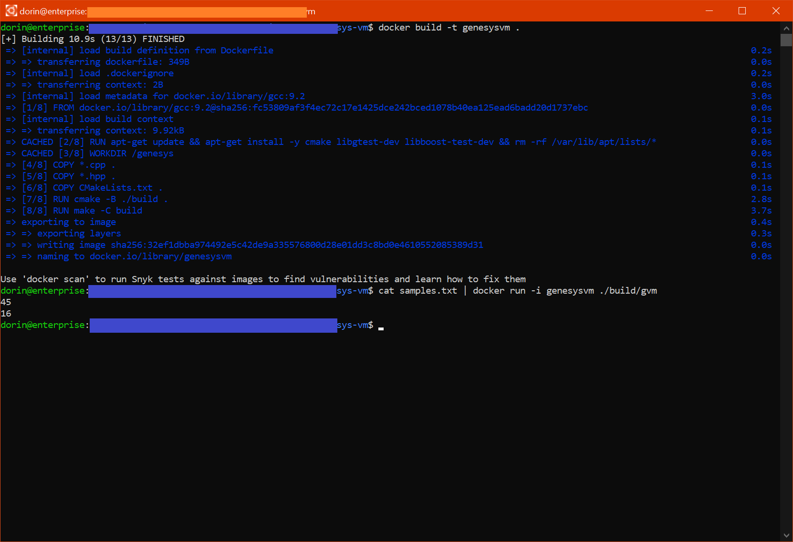

# Genesys VM

## Building and Running



### Option 1: Quick & Dirty

Runing the tests:
```sh
gcc tests.cpp genesys_vm.cpp -lstdc++ -o test_run -g
./test_run
```

Running the code with custom input:
```sh
gcc main.cpp genesys_vm.cpp -lstdc++ -o gvm_run
cat "samples.txt" | ./gvm_run

```

### Option 2: Using linux/windows

Please have the following dependencies installed:
- g++
- cmake

Building
```sh
cmake -B build .
cd build
make
./tests # run the tests
cat ../samples.txt | ./gvm # running the code with a custom sample
```

### Option 3: Using docker

```sh
docker build -t genesysvm .
docker run -it genesysvm # Running the tests
cat samples.txt | docker run -i genesysvm ./build/gvm # Running the code with custom input
```
